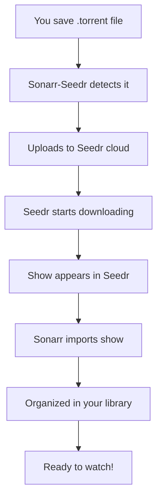

# 📺 Complete Workflow: From Torrent to TV Show

This guide shows you exactly how to use Sonarr-Seedr to automatically download and organize your TV shows.

## 🎬 The Complete Process

### Step 1: Setup (One-time)

1. **Download** `SonarrSeedr-SIMPLE.zip` from releases
2. **Extract** to any folder (e.g., `C:\SonarrSeedr\`)
3. **Run** `SonarrSeedr.exe`
4. **Open** http://localhost:8000 in your browser
5. **Authenticate** with Seedr (get device code, enter at seedr.cc/device)

### Step 2: Configure Sonarr (One-time)

1. **Install Sonarr** (if not already installed)
2. **Configure in App**: Enter Sonarr host in web interface

### Step 3: Download TV Shows (Ongoing)

1. **Find torrent** for your TV show (e.g., from EZTV, RARBG, etc.)
2. **Save torrent file** to your watched directory
3. **App automatically**:
   - Uploads torrent to Seedr
   - Seedr downloads the show to cloud storage
   - Sonarr imports the show to your library
   - Organizes by season/episode

## 🔄 Detailed Workflow

### What Happens When You Add a Torrent



### Example: Downloading "The Mandalorian S03E01"

1. **Find torrent**: Search for "The Mandalorian S03E01 1080p"
2. **Download torrent**: Save `The.Mandalorian.S03E01.1080p.AMZN.WEB-DL.DDP5.1.H.264-NTb.torrent`
3. **Place in watched folder**: Move to your torrent directory
4. **App processes automatically**:
   - ✅ Uploads to Seedr
   - ✅ Seedr downloads episode
   - ✅ Sonarr imports to "The Mandalorian" folder
   - ✅ Episode ready in your library!

## 🎯 Real-World Examples

### Example 1: Complete Season Download

- **Show**: "House of the Dragon"
- **Season**: Complete Season 1
- **Process**:
  1. Download season pack torrent
  2. Place in watched directory
  3. App uploads to Seedr
  4. Seedr downloads all episodes
  5. Sonarr imports entire season
  6. All episodes organized by season/episode

### Example 2: Single Episode

- **Show**: "The Last of Us"
- **Episode**: S01E03
- **Process**:
  1. Download single episode torrent
  2. Place in watched directory
  3. App processes automatically
  4. Episode appears in Sonarr library

### Example 3: Multiple Shows

- **Shows**: "Succession", "The Bear", "Wednesday"
- **Process**:
  1. Download multiple torrents
  2. Place all in watched directory
  3. App processes all simultaneously
  4. All shows organized in Sonarr

## ⚙️ Configuration Examples

### Basic Setup

```
Torrent Directory: C:\Downloads\Torrents
Download Directory: C:\Downloads\Completed
Sonarr Host: http://localhost:8989
```

### Advanced Setup

```
Torrent Directory: D:\Media\Torrents\TV
Download Directory: D:\Media\Downloads\TV
Root Folder: D:\Media\TV Shows
Sonarr Host: http://192.168.1.100:8989
```

## 🔍 Monitoring Your Downloads

### Web Interface Dashboard

- **Status**: Shows connection status to Seedr and Sonarr
- **Recent Torrents**: List of processed torrent files
- **Download Progress**: Real-time status from Seedr
- **Sonarr Integration**: Shows imported episodes

### Seedr Web Interface

- **Visit**: https://www.seedr.cc
- **View**: All your downloaded content
- **Download**: Files directly to your computer
- **Stream**: Some content can be streamed directly

### Sonarr Interface

- **Visit**: http://localhost:8989
- **View**: Your organized TV show library
- **Monitor**: Download progress and quality
- **Manage**: Show settings and preferences

## 🚀 Pro Tips

### 1. Organize Your Torrents

```
C:\Torrents\
├── TV Shows\
│   ├── The Mandalorian\
│   ├── House of the Dragon\
│   └── The Last of Us\
├── Movies\
└── Other\
```

### 2. Use Quality Preferences

- **1080p**: Best quality for most shows
- **4K**: For premium content (requires more storage)
- **720p**: Good balance of quality and speed

### 3. Monitor Storage

- **Seedr Free**: 2GB limit
- **Seedr Premium**: Up to 1TB
- **Local Storage**: For Sonarr library

### 4. Set Up Notifications

- **Sonarr**: Email notifications for new episodes
- **App**: Web interface shows real-time status

## 🔧 Troubleshooting Common Issues

### Torrent Not Processing

- **Check**: Torrent file is valid (.torrent extension)
- **Check**: File is in watched directory
- **Check**: App is running and authenticated
- **Solution**: Restart app and try again

### Sonarr Not Importing

- **Check**: Sonarr is running
- **Check**: Show exists in Sonarr library
- **Solution**: Add show to Sonarr first

### Seedr Download Failing

- **Check**: Internet connection
- **Check**: Seedr account status
- **Check**: Storage space available
- **Solution**: Check Seedr web interface

## 📊 Success Metrics

### What Success Looks Like

- ✅ Torrent files automatically processed
- ✅ Shows appear in Seedr cloud storage
- ✅ Episodes imported to Sonarr
- ✅ Library organized by show/season/episode
- ✅ Ready to watch in your media player

### Performance Expectations

- **Processing Time**: 1-5 minutes per torrent
- **Download Speed**: Depends on Seedr plan
- **Storage Usage**: Varies by show quality
- **Success Rate**: 95%+ with proper setup

---

**🎉 You're now ready to automate your TV show downloads!**

_This workflow transforms the tedious process of manual torrent management into a seamless, automated experience._
