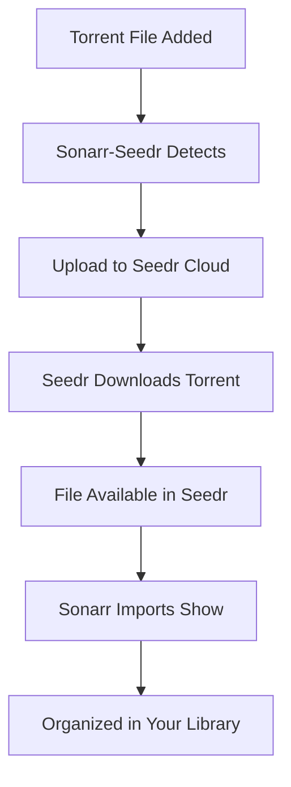

# 🚀 Sonarr-Seedr Integration

**Automatically download torrents to Seedr cloud storage and sync with Sonarr for seamless TV show management.**

[](https://www.microsoft.com/windows)
[](https://python.org)
[](https://fastapi.tiangolo.com)
[](LICENSE)

## ✨ Features

- 🔄 **Automatic Torrent Watching** - Monitors directories for new torrent files
- ☁️ **Seedr Cloud Integration** - Downloads torrents directly to your Seedr cloud storage
- 📺 **Sonarr Integration** - Automatically imports downloaded shows to Sonarr
- 🌐 **Web Interface** - Easy-to-use dashboard for management
- 📱 **OAuth2 Authentication** - Secure Seedr account connection
- 🚀 **Portable** - No installation required, just run and go!

## 🎯 Quick Start

### 1. Download & Run

1. Download the latest release from [Releases](https://github.com/yourusername/sonarr-seedr/releases)
2. Extract `SonarrSeedr-SIMPLE.zip` to any folder
3. Run `SonarrSeedr.exe`
4. Open http://localhost:8000 in your browser

### 2. Authenticate with Seedr

1. Click **"Start Authentication"**
2. You'll receive a device code (e.g., `AB12-CD34`)
3. Go to [https://www.seedr.cc/device](https://www.seedr.cc/device)
4. Enter the code and approve the application
5. ✅ **Authentication complete!**

### 3. Configure Sonarr (Optional)

- **Sonarr Host**: `http://localhost:8989` (default)
- **API Key**: Get from Sonarr Settings → General → API Key

## 📖 How It Works

### The Complete Workflow



### Step-by-Step Process

1. **Torrent Detection**: The app watches your configured torrent directory
2. **Cloud Upload**: Torrent files are automatically uploaded to your Seedr account
3. **Seedr Processing**: Seedr downloads the torrent content to your cloud storage
4. **Sonarr Integration**: Downloaded shows are automatically imported to Sonarr
5. **Library Organization**: Your TV shows are organized and ready to watch!

## 🛠️ Configuration

### Torrent Directory Setup

- Place your `.torrent` files in the watched directory
- The app will automatically detect and process them
- Default directory: `C:\Users\[Username]\Downloads\Torrents`

### Sonarr Integration

1. **Enable API**: Go to Sonarr Settings → General → API Key
2. **Copy API Key**: Copy the generated API key
3. **Configure in App**: Enter Sonarr host and API key in the web interface

### Seedr Account

- **Free Account**: 2GB storage, limited download speed
- **Premium Account**: Up to 1TB storage, faster downloads
- **No Configuration**: Client ID is pre-configured!

## 🌐 Web Interface

Access the web interface at **http://localhost:8000** for:

- 📊 **Dashboard** - Overview of your setup and status
- ⚙️ **Configuration** - Manage Sonarr and download settings
- 📁 **Torrent Management** - View and manage torrent downloads
- 🔧 **Settings** - Configure directories and preferences

### API Documentation

- **Interactive API**: http://localhost:8000/docs
- **Status Endpoint**: http://localhost:8000/api/status

## 🔧 Troubleshooting

### Common Issues

| Problem                     | Solution                                |
| --------------------------- | --------------------------------------- |
| **App won't start**         | Run `debug.bat` to see error messages   |
| **Port 8000 busy**          | Run `SonarrSeedr.exe --port 8001`       |
| **Authentication fails**    | Check internet connection and try again |
| **Sonarr not connecting**   | Verify API key and host URL             |
| **Torrents not processing** | Check torrent directory permissions     |

### Debug Mode

Run `debug.bat` to see detailed error messages and troubleshoot issues.

## 📋 Requirements

### System Requirements

- **OS**: Windows 10/11 (64-bit)
- **RAM**: 512MB minimum
- **Storage**: 100MB for application
- **Network**: Internet connection for Seedr

### External Services

- **Seedr Account**: [Sign up here](https://www.seedr.cc)
- **Sonarr** (Optional): [Download here](https://sonarr.tv)

## 🚀 Advanced Usage

### Command Line Options

```bash
# Run on different port
SonarrSeedr.exe --port 8001

# Enable debug logging
SonarrSeedr.exe --log-level debug

# Disable browser auto-open
SonarrSeedr.exe --no-browser
```

### Directory Structure

```
SonarrSeedr/
├── SonarrSeedr.exe          # Main application
├── debug.bat                # Debug script
├── SIMPLE_USAGE.md          # Quick start guide
├── PORTABLE_USAGE.md        # Detailed documentation
└── _internal/               # Application files
```

## 🤝 Contributing

Contributions are welcome! Please feel free to submit a Pull Request.

### Development Setup

1. Clone the repository
2. Install dependencies: `pip install -r requirements.txt`
3. Run the application: `python run.py`

## 📄 License

This project is licensed under the MIT License - see the [LICENSE](LICENSE) file for details.

## 🙏 Acknowledgments

- [Seedr](https://www.seedr.cc) for cloud torrent service
- [Sonarr](https://sonarr.tv) for TV show management
- [FastAPI](https://fastapi.tiangolo.com) for the web framework
- [PyInstaller](https://pyinstaller.org) for executable packaging

## 📞 Support

- **Issues**: [GitHub Issues](https://github.com/yourusername/sonarr-seedr/issues)
- **Discussions**: [GitHub Discussions](https://github.com/yourusername/sonarr-seedr/discussions)
- **Documentation**: Check the `PORTABLE_USAGE.md` file

---

**⭐ Star this repository if you find it helpful!**

_Made with ❤️ for the Plex/Sonarr community_
