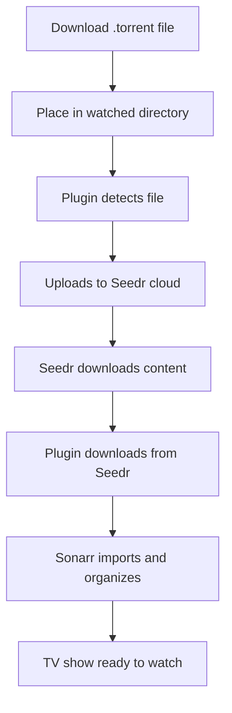

# 🖥️ Windows Setup Guide - Sonarr-Seedr Plugin

**Complete guide to set up the Sonarr-Seedr plugin on Windows for automatic torrent downloading and TV show organization.**

---

## 📋 Table of Contents

1. [System Requirements](#-system-requirements)
2. [Prerequisites](#-prerequisites)
3. [Installation Steps](#-installation-steps)
4. [Initial Configuration](#-initial-configuration)
5. [Sonarr Setup](#-sonarr-setup)
6. [Seedr Account Setup](#-seedr-account-setup)
7. [Complete Workflow](#-complete-workflow)
8. [Troubleshooting](#-troubleshooting)
9. [Advanced Configuration](#-advanced-configuration)
10. [FAQ](#-faq)

---

## 🖥️ System Requirements

### Minimum Requirements

- **Operating System**: Windows 10 (64-bit) or Windows 11
- **RAM**: 512MB minimum (1GB recommended)
- **Storage**: 100MB for application files
- **Network**: Stable internet connection
- **Ports**: 8000 (default web interface), 8989 (Sonarr)

### Recommended Requirements

- **RAM**: 2GB or more
- **Storage**: 1GB+ for application and temporary files
- **Network**: High-speed internet for faster downloads
- **SSD**: For better performance

---

## 📦 Prerequisites

### 1. Seedr Account

- **Free Account**: 2GB storage, limited download speed
- **Premium Account**: Up to 1TB storage, faster downloads
- **Sign up**: [https://www.seedr.cc](https://www.seedr.cc)

### 2. Sonarr (Optional but Recommended)

- **Download**: [https://sonarr.tv](https://sonarr.tv)
- **Purpose**: Organize and manage your TV show library
- **Alternative**: Use without Sonarr for basic torrent downloading

### 3. Windows Features

- **Windows Defender**: May need to allow the application
- **Firewall**: Ensure port 8000 is accessible
- **User Account Control**: May require admin privileges for some operations

---

## 🚀 Installation Steps

### Step 1: Download the Plugin

1. **Download** the latest release from the releases page
2. **Extract** `SonarrSeedr-SIMPLE.zip` to any folder
   - Example: `C:\SonarrSeedr\`
   - Avoid system folders like `Program Files`

### Step 2: Extract Files

```
C:\SonarrSeedr\
├── SonarrSeedr.exe          # Main application
├── debug.bat                # Debug script
├── README.md                # Documentation
├── SIMPLE_USAGE.md          # Quick start guide
├── COMPLETE_WORKFLOW.md     # Detailed workflow
└── _internal\               # Application files (don't modify)
```

### Step 3: Run the Application

1. **Double-click** `SonarrSeedr.exe`
2. **Wait** for the application to start (may take 10-30 seconds)
3. **Browser** should automatically open to `http://localhost:8000`
4. If browser doesn't open, manually navigate to the URL

### Step 4: Verify Installation

- ✅ **Web Interface**: Should load at `http://localhost:8000`
- ✅ **No Error Messages**: Check console output for errors
- ✅ **Port Available**: Ensure port 8000 isn't used by another application

---

## ⚙️ Initial Configuration

### Step 1: Access Web Interface

1. **Open** your web browser
2. **Navigate** to `http://localhost:8000`
3. **Wait** for the dashboard to load

### Step 2: Configure Directories

1. **Click** "Settings" or "Configuration" in the web interface
2. **Set Torrent Directory**:

   - Choose where you'll place `.torrent` files
   - Example: `C:\Users\[YourName]\Downloads\Torrents`
   - **Create** the folder if it doesn't exist

3. **Set Download Directory**:

   - Choose where completed downloads will be saved
   - Example: `C:\Users\[YourName]\Downloads\Completed`
   - **Create** the folder if it doesn't exist

4. **Click** "Save Configuration"

### Step 3: Start Torrent Watcher

1. **Navigate** to "Folder Watcher" section
2. **Click** "Start Watcher"
3. **Verify** status shows "Running"
4. The app will now monitor your torrent directory

---

## 📺 Sonarr Setup

### Step 1: Install Sonarr (if not already installed)

1. **Download** Sonarr from [https://sonarr.tv](https://sonarr.tv)
2. **Install** following the Windows installer
3. **Start** Sonarr service
4. **Access** web interface at `http://localhost:8989`

### Step 2: Configure Plugin with Sonarr

1. **Open** Sonarr-Seedr web interface (`http://localhost:8000`)
2. **Go to** Configuration section
3. **Enter** Sonarr details:
   - **Host**: `http://localhost:8989` (default)
4. **Click** "Save Configuration"
5. **Test** connection to verify it works

### Step 3: Set Up Root Folder in Sonarr

1. **In Sonarr**, go to Settings → Media Management
2. **Add** a root folder for your TV shows
   - Example: `C:\TV Shows` or `D:\Media\TV Shows`
3. **Note** this path for later use

---

## ☁️ Seedr Account Setup

### Step 1: Create Seedr Account

1. **Visit** [https://www.seedr.cc](https://www.seedr.cc)
2. **Sign up** for a free account
3. **Verify** your email address
4. **Note** your login credentials

### Step 2: Authenticate with Plugin

1. **In the plugin web interface**, click "Start Authentication"
2. **You'll receive** a device code (e.g., `AB12-CD34`)
3. **Open** a new browser tab
4. **Go to** [https://www.seedr.cc/device](https://www.seedr.cc/device)
5. **Enter** the device code
6. **Approve** the application
7. **Return** to the plugin interface
8. **Wait** for authentication to complete

### Step 3: Verify Connection

- ✅ **Status** should show "Connected to Seedr"
- ✅ **Account info** should display your Seedr details
- ✅ **No error messages** in the interface

---

## 🔄 Complete Workflow

### How It Works



### Step-by-Step Process

#### 1. Find a Torrent

- **Search** for TV show torrents on sites like EZTV, RARBG, etc.
- **Download** the `.torrent` file to your computer

#### 2. Add to Watched Directory

- **Copy** or **move** the `.torrent` file to your configured torrent directory
- **Example**: `C:\Users\[YourName]\Downloads\Torrents\`

#### 3. Automatic Processing

The plugin will automatically:

- ✅ **Detect** the new torrent file
- ✅ **Upload** it to your Seedr account
- ✅ **Start** downloading in Seedr cloud
- ✅ **Monitor** download progress
- ✅ **Download** completed files to your local directory
- ✅ **Import** to Sonarr for organization

#### 4. View Results

- **Check** Seedr web interface for cloud downloads
- **Check** Sonarr for organized TV shows
- **Check** your local download directory for files

---

## 🔧 Troubleshooting

### Common Issues and Solutions

#### ❌ Application Won't Start

**Problem**: `SonarrSeedr.exe` doesn't start or crashes immediately

**Solutions**:

1. **Run as Administrator**: Right-click → "Run as administrator"
2. **Check Windows Defender**: Add exception for the application folder
3. **Use Debug Mode**: Run `debug.bat` to see error messages
4. **Check Port**: Ensure port 8000 isn't used by another application

#### ❌ Port 8000 Already in Use

**Problem**: "Port 8000 is already in use" error

**Solutions**:

1. **Find and close** the application using port 8000
2. **Use different port**: Run `SonarrSeedr.exe --port 8001`
3. **Check** if another instance is already running

#### ❌ Authentication Fails

**Problem**: Can't connect to Seedr account

**Solutions**:

1. **Check internet connection**
2. **Verify** device code is entered correctly
3. **Try again** - codes expire after 15 minutes
4. **Check** Seedr account status
5. **Clear** browser cache and cookies

#### ❌ Sonarr Connection Fails

**Problem**: Plugin can't connect to Sonarr

**Solutions**:

1. **Verify** Sonarr is running
2. **Verify** host URL (usually `http://localhost:8989`)
3. **Check** Sonarr firewall settings
4. **Restart** both applications

#### ❌ Torrents Not Processing

**Problem**: Torrent files aren't being uploaded to Seedr

**Solutions**:

1. **Check** torrent directory permissions
2. **Verify** watcher is running
3. **Check** file extensions (must be `.torrent` or `.magnet`)
4. **Review** log files for errors
5. **Restart** the watcher service

#### ❌ Downloads Not Importing to Sonarr

**Problem**: Files download but don't appear in Sonarr

**Solutions**:

1. **Check** Sonarr root folder configuration
2. **Verify** show exists in Sonarr library
3. **Check** file naming conventions
4. **Review** Sonarr logs for import errors
5. **Manually** trigger import in Sonarr

### Debug Mode

**To troubleshoot issues**:

1. **Close** the main application
2. **Run** `debug.bat` instead of `SonarrSeedr.exe`
3. **Read** the error messages in the console
4. **Check** the log file: `_internal\folder_watcher.log`

### Log Files

**Important log locations**:

- **Main log**: `_internal\folder_watcher.log`
- **Application logs**: Console output when running `debug.bat`
- **Sonarr logs**: Check Sonarr's log directory
- **Windows Event Viewer**: For system-level errors

---

## ⚙️ Advanced Configuration

### Command Line Options

```bash
# Run on different port
SonarrSeedr.exe --port 8001

# Enable debug logging
SonarrSeedr.exe --log-level debug

# Disable browser auto-open
SonarrSeedr.exe --no-browser

# Run in background
SonarrSeedr.exe --daemon
```

### Directory Structure

```
C:\SonarrSeedr\
├── SonarrSeedr.exe              # Main application
├── debug.bat                    # Debug script
├── _internal\                   # Application files
│   ├── app\                     # Application code
│   ├── config\                  # Configuration files
│   │   ├── seedr_token.json     # Seedr authentication
│   │   └── watcher_config.json  # Watcher settings
│   ├── processed\               # Successfully processed torrents
│   ├── error\                   # Failed torrents
│   └── folder_watcher.log       # Application log
├── downloads\                   # Completed downloads (if configured)
└── torrents\                    # Watched torrent directory (if configured)
```

### Configuration Files

#### `watcher_config.json`

```json
{
  "torrent_dir": "C:\\Users\\[Username]\\Downloads\\Torrents",
  "download_dir": "C:\\Users\\[Username]\\Downloads\\Completed",
  "watch_interval": 30,
  "save_magnet_files": true,
  "magnet_extension": ".magnet",
  "auto_start": true
}
```

#### `seedr_token.json`

```json
{
  "access_token": "your_access_token_here",
  "refresh_token": "your_refresh_token_here",
  "expires_at": 1234567890
}
```

### Performance Optimization

#### For Better Performance:

1. **Use SSD** for download directories
2. **Increase** watch interval for large directories
3. **Close** unnecessary applications
4. **Use** wired internet connection
5. **Monitor** disk space regularly

#### For Large Libraries:

1. **Organize** torrents in subdirectories
2. **Use** separate directories for different content types
3. **Regularly** clean up processed files
4. **Monitor** Seedr storage usage

---

## ❓ FAQ

### General Questions

**Q: Do I need to keep the application running?**
A: Yes, the application must be running to monitor for new torrent files and manage downloads.

**Q: Can I use this without Sonarr?**
A: Yes, you can use it just for downloading torrents to Seedr cloud storage without Sonarr integration.

**Q: Is this legal?**
A: The plugin is a tool. You are responsible for ensuring you have the right to download the content you're accessing.

**Q: Can I run this on a server?**
A: Yes, but you'll need to configure firewall rules and may need to run it as a service.

### Technical Questions

**Q: What file formats are supported?**
A: The plugin supports `.torrent` files and `.magnet` files (magnet links saved as text files).

**Q: Can I change the web interface port?**
A: Yes, use the `--port` command line option or modify the configuration.

**Q: How do I update the plugin?**
A: Download the latest version and replace the files, keeping your configuration files.

**Q: Can I use this with other media managers?**
A: Currently, it's designed for Sonarr, but you can use it without Sonarr for basic torrent downloading.

### Troubleshooting Questions

**Q: The application starts but the web interface won't load**
A: Check if port 8000 is available and try running as administrator.

**Q: Torrents upload to Seedr but don't download locally**
A: Check your download directory permissions and ensure the watcher is running.

**Q: Sonarr shows files but they're not organized properly**
A: Check your Sonarr root folder configuration and file naming conventions.

**Q: The application uses too much memory**
A: This is normal for Python applications. Consider closing other applications if needed.

---

## 🆘 Getting Help

### Support Resources

1. **Documentation**: Check `README.md`, `SIMPLE_USAGE.md`, and `COMPLETE_WORKFLOW.md`
2. **Debug Mode**: Run `debug.bat` for detailed error information
3. **Log Files**: Check `_internal\folder_watcher.log` for application logs
4. **GitHub Issues**: Report bugs and request features on the project page

### Before Asking for Help

1. **Read** this guide completely
2. **Check** the troubleshooting section
3. **Run** debug mode and check logs
4. **Verify** all prerequisites are met
5. **Try** restarting the application

### Information to Include When Asking for Help

- **Windows version** (e.g., Windows 10 21H2)
- **Error messages** from debug mode
- **Log file contents** (last 50 lines)
- **Steps** you've already tried
- **Configuration** you're using

---

## 🎉 Success!

Once everything is set up correctly, you should have:

- ✅ **Automatic torrent monitoring** - Drop torrent files and they're processed automatically
- ✅ **Cloud downloading** - Torrents download to your Seedr cloud storage
- ✅ **Local organization** - Files are downloaded and organized by Sonarr
- ✅ **Web interface** - Easy management through your browser
- ✅ **Seamless workflow** - From torrent file to organized TV show library

**Enjoy your automated TV show downloading experience!** 🎬📺

---

_This guide covers the complete setup process for the Sonarr-Seedr plugin on Windows. For additional help, refer to the other documentation files or check the troubleshooting section._
